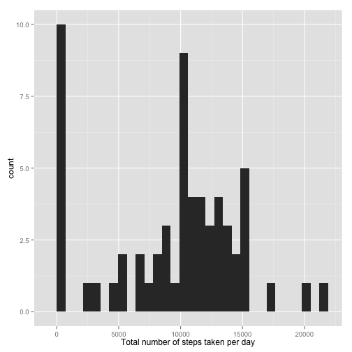
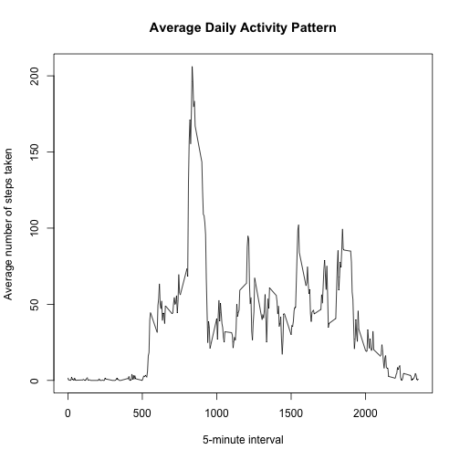
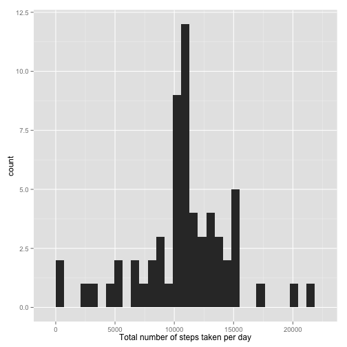
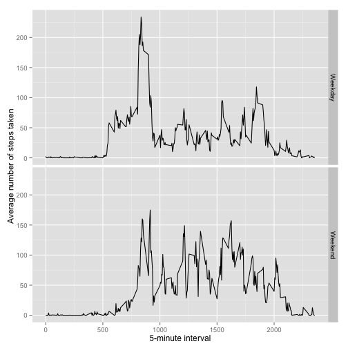

# Reproducible Research: Peer Assessment 1
## Loading and preprocessing the data

```r
data <- read.csv("activity.csv")
data$date <- as.Date(data$date,"%Y-%m-%d") # for later usage
```

## What is mean total number of steps taken per day?

```r
library(ggplot2)
total_step <- tapply(data$steps, data$date, sum, na.rm=TRUE)
qplot(total_step, xlab="Total number of steps taken per day")
```

```
## stat_bin: binwidth defaulted to range/30. Use 'binwidth = x' to adjust this.
```

 

Calculate mean and median total number of steps taken per day

```r
mean(total_step, na.rm=TRUE)
```

```
## [1] 9354
```

```r
median(total_step, na.rm=TRUE)
```

```
## [1] 10395
```

## What is the average daily activity pattern?

```r
average_step <- tapply(data$steps, data$interval, mean, na.rm=TRUE)
plot(row.names(average_step), average_step,type="l",
     xlab="5-minute interval", 
     ylab="Average number of steps taken", 
     main="Average Daily Activity Pattern")
```

 
Find the 5-minute interval which contains the maximum number of steps

```r
max_average <- which.max(average_step)
names(max_average)
```

```
## [1] "835"
```

## Imputing missing values


```r
sum(is.na(data))
```

```
## [1] 2304
```
Fill in NA columns with average number of steps in 5-minute interval

```r
imputed_data <- data  # make a copy of data
imputed_data$steps[is.na(imputed_data$steps)] <- average_step
imputed_total_step <- tapply(imputed_data$steps, imputed_data$date, sum, na.rm=TRUE)
qplot(imputed_total_step, xlab="Total number of steps taken per day")
```

```
## stat_bin: binwidth defaulted to range/30. Use 'binwidth = x' to adjust this.
```

 

```r
mean(imputed_total_step)
```

```
## [1] 10766
```

```r
median(imputed_total_step)
```

```
## [1] 10766
```
Both mean and median values are higher after imputing NA values. Because those NA values for some days in a interval would be set to 0s by default, thus decrease the overall estimation.  

## Are there differences in activity patterns between weekdays and weekends?


```r
weekday <- weekdays(data$date)
# handle the language system problem
data$weektype = ifelse(weekday=="周六" | weekday =="周日" | weekday =="Saturday" | weekday =="Sunday", "Weekend", "Weekday")
# Draw a comparison graph of activity patterns between weekdays and weekends 
averages <- aggregate(steps~interval+weektype, data=data, mean)
ggplot(averages, aes(interval, steps)) + geom_line() + facet_grid(weektype~.) +
       xlab("5-minute interval") + ylab("Average number of steps taken")
```

 

